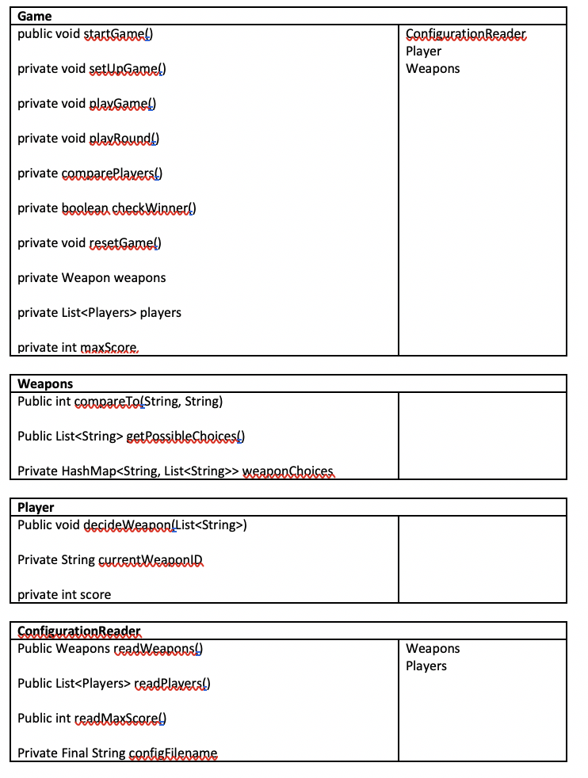

# Team Discussion - Sept. 12

## RPS Design

## Inheritance

We worked on Ben's Breakout game and chose to refactor the powerup class into sub-classes, which were extralife, addball, and winlevel.

- Bricks:
    - public void updateNumberOfHits()
        - updates the number of hits left it will take to destroy the brick
- Power ups
    - public void fall()
        - moves the power up towards the bottom of the screen
    - pubic boolean checkHitBotton()
        - checks to see if the powerup hit the bottom of the screen
- Levels
    - public void getFileInputs()
        - gets the information of brick positions from file
    - public boolean didWin()
        - checks to see if user won the level
    - public void updateLevel()
        - updates the conditions of the level

## Cell Society High Level Design

1. The Cell class will have a private instance variable that contains information about the cell's location in the grid. Neighbors can be deduced from that. The cell will have two states, current and next. Next state is updated when you check for neighbors and current state is updated when the neighbor check of all cells is finished.
2. A cell, when checking for neighbors, will take a Rule object as a parameter, which will allow the cell to update its current state based on the current game rules.
3. The grid is just a collection of cells. It loops through its cells and updates the cells. The front-end needs to know the state of the grid.
4. The rules, cells, cells neighbor.
5. The front end should have a method updateGUI, which is called after the back-end finishes updating one state. 

## Class-Responsibility-Collaborator Cards

