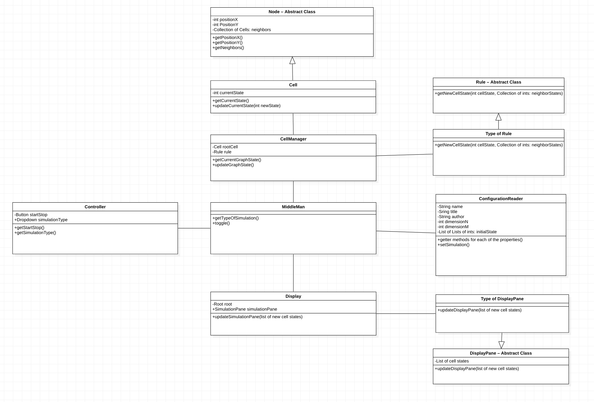

# Introduction
### Problem
In general, the problem we are trying to solve by creating this application is how to represent cellular automata using Java, OpenJFX, and XML. 

### Design Goals
The exact implementation of the grid, cells, and rules was left up to us. Given that, we are not using a grid in the backend but a graph with each cell as a node. The cells will have well defined processes for changing states as well as well defined positions in the grid.

The XMl file will be hard coded beforehand. This file will contain the initial state of all the cells in the grid, along with what rules will be used for this simulation.

### Primary Architecture

- 2d Graph, size(m x n) that contains nodes (cells)
- A front end that receives information from this graph and displays whether cells are on or off
- XML Reader that reads the XML file and classes that contain rules of the simulation.
- A back end that recevies information from XML Reader and classes that contatin rules of the simulation.

# Overview
The overarching classes that will be used are the `Node` class, the `CellManager` class, the `Rules.SimulationRules` class, the `ConfigurationReader` class, the `Controller` class, the `Display` class, and the `Controller` class.

The `Node` class will be an abstract class with the subclasses `GameOfLifeCell`, `SegregationCell`, `PredatorPreyCell`, `FireCell`, and `PercolationCell`. Each cell contains a cell's type (depending on the simulation, current state, position, and pointers to its neighboring cells. The cell graph will be stored in a LinkedList style. 

The root cell will be held in the `CellManager` class along with an instance of the appropriate `Rules.SimulationRules` class. The `Rules.SimulationRules` class will be an abstract class with the subclasses `Rules.SimulationRules.SimulationRules.GameOfLifeRules`, `Rules.SimulationRules.SimulationRules.SegregationRules`, `PredatorPreyRules`, `FireRules`, and `Rules.SimulationRules.SimulationRules.PercolationRules`. The `Rules.SimulationRules` class will have a method that allows the cell manager to get the rules based on the configuration. The `CellManager` will then use these rules to update each cell in the linked list by calling the update method on each cell and copying this updated cell to a new linked list.

The `CellManger` and the `Display` will be handled by the `Controller` class. This `Controller` class has a `ConfigurationReader` object from which it obtains the current configuration. The `ConfigurationReader` reads the XML file and passes the configuration to the `Controller`. When the `CellManager` is constructed by the `Controller`, it is told which rule class to instantiate. The `Controller` is then responsible for telling the `CellManager` when to update.

The `Controller` is also responsible for telling the `Display` class the current state of the grid. This will then allow the `Display` class to update the UI.

Finally, the `Controller` class takes in the input from the user for starting and stopping the simulation. This input is then given to the `Controller` so that it can determine whether or not it should be sending update signals to the `CellManager` and `Display` classes.

# User Interface
When the user starts the program, a screen will pop up with a blank grid area and a start button. When the user clicks on the start button or presses the enter button, the simulation will start. The start button will then change to a stop button. If the user clicks the stop button or presses enter, the simulation will pause. If the user clicks start and lets the simulation run, it will continue to run indefinitely. The images below show what the UI might look like.

In the event that a user attempts to start the program with an incorrect or empty configuration file, the program will display this error on the user interface. A possible version of this can be seen below.

# Design Details
Below is the outline for how the data structures and architecture of the program will be layed out.
- `Node`
    - Subclasses
        - `GameOfLifeCell`
        - `SegregationCell`
        - `PredatorPreyCell`
        - `FireCell`
        - `PercolationCell`
    - Properties
        - Integers holding the `positionX` and `positionY` values. Along with an array holding pointers to its cell neighbors. Within the subclasses, there are `currentState` that will vary depending on the simulation.
    - Public Methods
        - `getPositionX()` and `getPositionY()` are used to obtain the cell's location in the grid as integers. The `getNeighbors()` method will return the pointers to the cell's neighbors. Within the subclasses, there are `getCurrentState()` and `updateCurrentState()` that will vary depending on the simulation.
    - Dependencies
        - None
    - Depends on it
        - `CellManager`
    - How it can be extended
        - Cell type does not matter to the node abstract class, so we can extend this class to any type of cell, no matter its shape, set of states, or functionality. 
    - Justification
        - This abstract class allows us to fulfill our design goal of making the backend completely seperate from the front end, in that the node class does not have a UI component, rather it is represented as node. 
- `CellManager`
    - Subclasses
        - None
    - Properties
        - A `Rule` object to hold the current rules for the simulation. A root cell that is a child of the `Node` class which points to the (0,0) cell in the graph.
    - Public Methods
        - `getCurrentGraphState()` which returns a linked list with each node containing purely the position and state of the node in the grid. The`updateCurrentGraphState()` which does not take any parameters but tells the `CellManager` to make a step in the simulation. This method returns `false` in the event of an error and `true` otherwise.
    - Dependencies
        - `Rules.SimulationRules`
    - Depends on it
        - `Controller`
    - Justification
        - The cell manager allows us to update the cells according to rules, while keeping the cells and rules completely seperate. Thus, making it easier to switch between simulation types.
- `Rules.SimulationRules`
    - Subclasses
        - `Rules.SimulationRules.SimulationRules.GameOfLifeRules`
        - `Rules.SimulationRules.SimulationRules.SegregationRules`
        - `PredatorPreyRules`
        - `FireRules`
        - `Rules.SimulationRules.SimulationRules.PercolationRules`
    - Properties
    - Public Methods
        - The `getNewCellState()` method takes in a root cell's properties along with the cell's neighbors' properties and returns the new state of the cell. The state of each type of cell is represented as an integer.
    - Dependencies
        - None
    - Depends on it
        - `CellManager`
    - How to extend
        - The  "Rules.SimulationRules" class defines the genral structure of the rules and holds shared methods for implementing the simulations based on the rules.
    - Justification
        - By having an abstract class, we can not only benefit from common properties that the rules have but also use these common properties in different manner.
- `ConfigurationReader`
    - Subclasses
        - None
    - Properties
        - This will hold all the properties read from the XML file upon starting the program. A String will hold the `name` of the simulation, a String will hold the `Title` of the simulation, and a String will hold the `author` of the simulation. Integers will be used for holding `dimensionN` and `dimensionM` for the grid. And finally a list of states will be held in the list `initialState`.
    - Public Methods
        - This method will have getters for getting the above properties including `getSimulationName()`, `getAuthorName()`, `getXDimension()`, `getYDimension()`, `getInitialStates()`. The `setSimulation()` method tells the `ConfigurationReader` from which simulation to grab the properties, which takes a string as a paremeter.
    - Dependencies
        - None
    - Depends on it
        - `Controller`
    - How to extend
        - Technically we can extend it to read more than XML files; however, this wont be necessary for the project.
    - Justification
        - The configuration reader allows us to read constants from the configuration files and avoid hard coding constants into the classes themselves, as well as getting different constants as the simulation type is switched. 
- `Controller`
    - Subclasses
        - None
    - Properties
        - A button called `startStop` to allow the user to start and stop the simulation. A dropdown called `simulationType` that allows the user to choose which simulation runs. Both of these objects are native JavaFX object classes.
    - Public Methods
        - The `getStartStop()` method returns a boolean value. If `true` then the simulation has started and should run. If `false` then the simulation should stop. The `getSimulationType()` method returns a string. 
    - Dependencies
    - Depends on it
        - `Controller`
    - How to extend
        - The controller can be extended to add more buttons including a restart simulation button. Or possibly even some ability to change the paramters of a simulation, thereby modifying the XML file used to set the initial state.
    - Justification
        - We initially were going to put these in the `Controller` class but wanted to make the code modular and, thereby, easier to read. But also the `Controller` is not responsible for talking to the user so we created this class to get user inpu. The`Controller` could then retrieve this input, which would then decide how to handle the back-end. Note that the controller does not tell the `Controller` to do anything which removes power from the front end to make unsolicited changes to the back-end.
- `Display`
    - Subclasses
        - `GameOfLifeDisplay`
        - `SegregationDisplay`
        - `PredatorPreyDisplay`
        - `FireDisplay`
        - `PercolationDisplay`
    - Properties
        - List indicating `cellStates`. The list will have integer values for the cell states. Each subclass will have a different display method depending which simulation is running.
    - Public Methods
        - `updateDisplayPane()` takes in a new list of states and updates the current grid to match the new one.
    - Dependencies
        - None
    - Depends on it
        - `Controller`
    - How to extend
        - The display class displays different types of cells depending on the simulation being run. It also reads the list containing the grid differently for different simulation types. The extension of this will be to add more simulation type subclasses for new simulations.
    - Justification
        - We wanted to follow the principle of not having one class do both the computation of the grid and the displaying of the grid. Ergo, we create a `Display` class that purely handles the displaying of cells based on the data it currently has. It doesn't tell anyone to update and doesn't modify data in any way. It simply reads the current data and displays accordingly. This keeps it from having too much control over the program.
- `Controller`
    - Subclasses
        - None
    - Properties
    - Public Methods
        - `start()`: The `Controller` class will hold the `main()` function for the JavaFX program. The `main()` function will call `start()` through the `launch(args)` command, per JavaFX syntax.
    - Dependencies
        - `CellManager`, `Display`, `ConfigurationReader`, `Controller`
    - Depends on it
        - main class
    - How to extend
        - The middle man maps the graph from the back end to the grid for the front end. As more simulations are incorporated, this class will need to be extended to take those mappings into account.
    - Justification
        - The middle man keeps the front end and back end completely seperate by handling the translation and flow of information between the two classes. Otherwise, the back end and front end would have to communicate directly, making that integration really messy. 

# Design Considerations
The team spent time discussing the following design considerations:

1. How to represent the simulation grid in the back-end

The team first discussed the most abstract way to represent the grid. We ultimately decided that it is not necessary for the back end to even hold a representation of the grid. The backend will maintain a graph where cells are nodes and neighbors are connections. 

An alternate design we considered was maintaining a grid class in the middleMan that would be structured in a similar way to how we would display the grid on the front end. The major pro of this alternate design choice is that it would be very easy to pipeline information from the grid class to the front end. However, the con of this alternate design is that it's more difficult to extend the grid class to other types of simulations. 

The pro of our design choice is the fact that a graph does not rely on specific UI information about the simulation type, for example the cell shape or the dimension of the grid, to update cells and find neighbors. This makes it easier to abstract the graph class. However, the major con of designing our apllication in this manner is the fact that the middleMan is given the responsibility of translating information about the graph of cells to UI information about which cells should be turned on or off. 

2. Should a cell update istelf or should the rule class update a cell:

Another issue the team ran into was whether the cell class should handle the responsibility of updating itself. Ultimately we decided on giving the rule class the responsibility of updating a cell and giving the cell class a public method called setState. 

3. Linked List vs. HashMap

We also spent some time discussing the implementation of how to structure our graph data. We tentatively decided on using a linked list to represent the graph, for efficiency reasons and our own personal preferences with using linked lists.

### Dependencies and Assumptions

Overall, we tended to make as little assumptions as possible regarding the input data, and we tried not to limit the scope of what our application can be extended to. We did, however, make the dependency that the position of each cell in the grid will need to be written in the XML file. 

# Team Responsibilities
### Riley
- Controller 
- Simulation
- Controller (secondary)

### Kyle
- Rules.SimulationRules
- ConfigurationReader
- Controller (primary)

### Ben
- Node
- Cell
- Cell Manager

### High-Level Plan
We wrote in our design doc the public method return types and paremeter types. We will use that to complete our portion of the application. We will give general updates.

# Use Cases
The following scenarios are provided to help test the completeness and flexibility of your design. By writing the steps needed to complete each case below you will be able to see how effectively your design handles these scenarios and others will be able to better understand how deeply you have considered the basic issues.

Apply the rules to a middle cell: set the next state of a cell to dead by counting its number of neighbors using the Game of Life rules for a cell in the middle (i.e., with all its neighbors)
- Within the `Cell Manager`, the `updateCell` method will call the instance of the Rules.SimulationRules in order to use `getNeighbors` and `getNeighborsState`. These classes will get the neighbors of the middle cell, and then it will get the states of its neighbors. Finally it will change the states of the its neighbor cells using setCellState().

Apply the rules to an edge cell: set the next state of a cell to live by counting its number of neighbors using the Game of Life rules for a cell on the edge (i.e., with some of its neighbors missing)
- We will do the same process in the first question. The cell, however, will have less neighbor cells compared to the previous one, so we set the states of the neighbor cells accordingly.

Move to the next generation: update all cells in a simulation from their current state to their next state and display the result graphically
- After applying the rules to all of the cells, we will pass the new list of lists of the cells to the `Display` class which will change the appreance of the grid on the screen.

Set a simulation parameter: set the value of a parameter, probCatch, for a simulation, Fire, based on the value given in an XML fire
- The`Config Reader` class will read the XML file inputs and set parameters as needed in the file.

Switch simulations: use the GUI to change the current simulation from Game of Life to Wator
- We will a add buton in the user interface that will enable the user to switch the simluations by reading a new XML file.